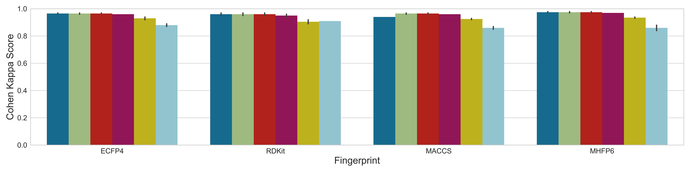
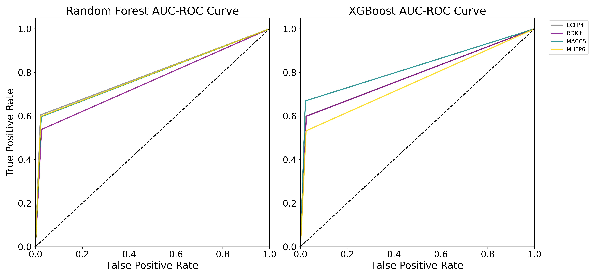

# E3 ligase and binder prediction models

This repository contains two machine learning models and is populated with already trained models which can be used for immediate prediction with test data. Some details of the models are as follows: 

1. e3liagse_prediction.py predicts candidate E3 ligases for compounds.
2. e3binder_prediction.py predicts if a compound is E3-binder or non-binder.

The required packages with version numbers are listed in requirements.txt. 

The models are trained with several ML-algorithms such as xgboost, random forest, naive bayes, linear regression, lightgbm and decision trees. The performance of each model is shown below.

The AUC-ROC curves of two best performing models are shown below.

